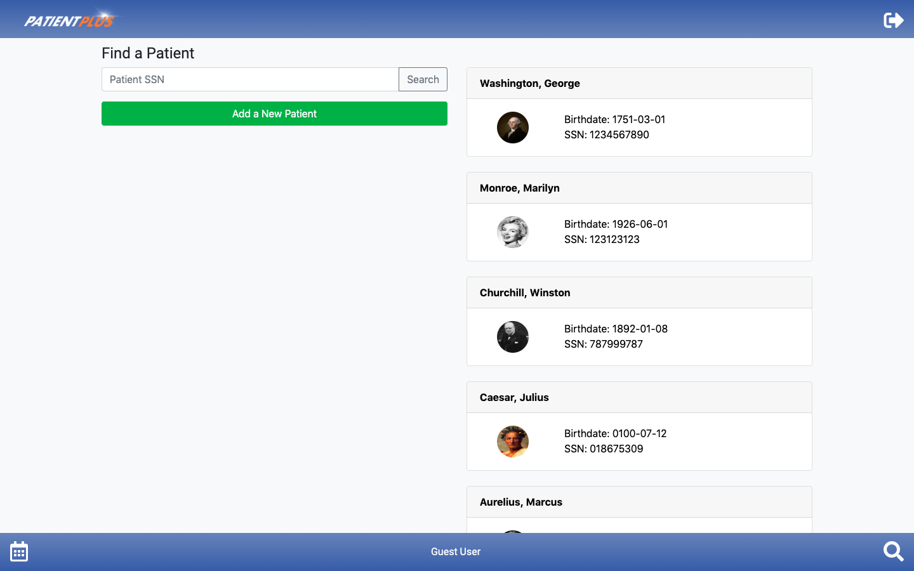
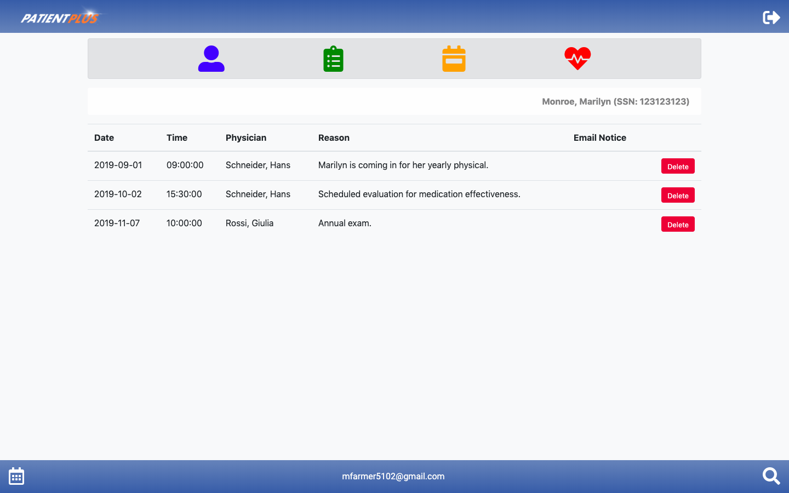
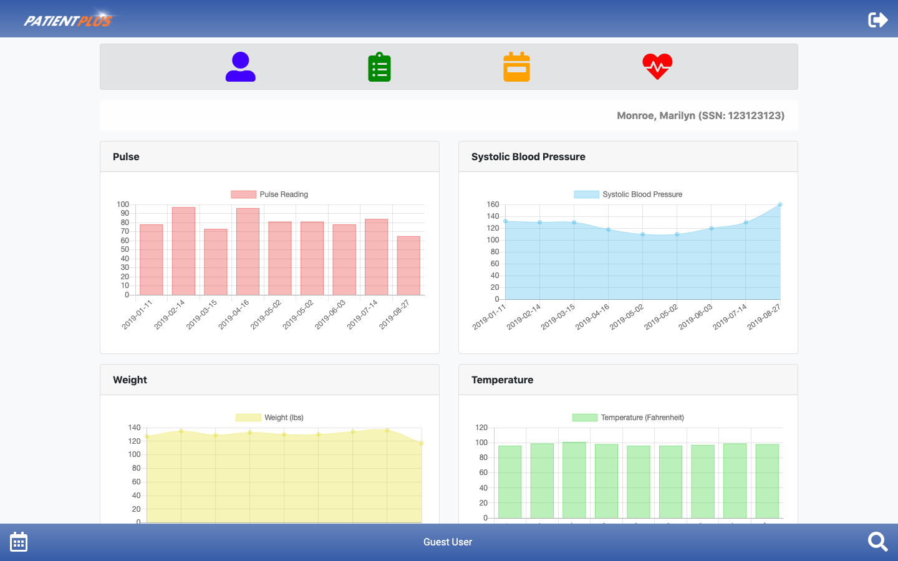
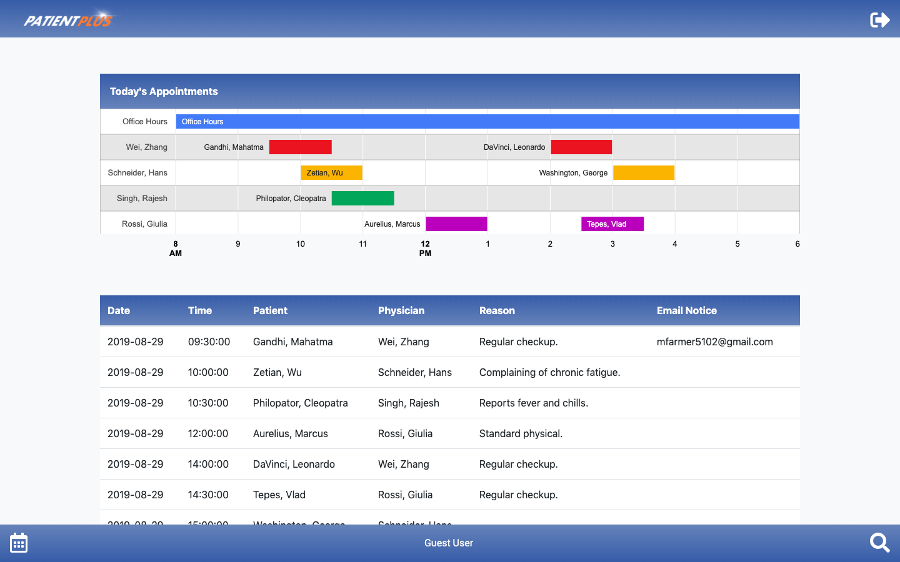

# **Patient Plus**

## Credits

©2019 Matthew Farmer, Mark Bullard, Sarah Werner, and Zacharey Casey

## Application Link

http://patientplus.herokuapp.com/

## About

Patient Plus is an electronic patient management system designed to serve a doctor’s office, hospital, or other medical environment. It is designed to empower medical professionals to record and analyze data, make predictions from historical trends, schedule appointments, and reduce risk of mistaken patient identity.

## Walkthrough

### Login

Upon accessing the application, users are prompted for their login credentials. Users who do not wish to login or create an account my opt to proceed as a guest.

### Patient Search

After logging in, users may enter the SSN for a particular patient. If a valid SSN is entered for an existing patient, a patient card will be returned. If the patient does not yet exist in the system, users may click 'Add a New Patient' to add the patient to the database. Clicking on the patient card will direct the user to the patient's profile.

### Patient Information

The patient information page is the landing page for each patient's profile. Users may reference personal information as well as contact information. From this page, a new snapshot may be added, an appointment scheduled, patient information edited, or the print wrsitband feature accessed.

### Print Wristband

The print wristband page contains a QR code unique to each patient as well as the patient's name and date of birth. Upon printing this page, a wristband may be cut out and applied to a patient's wrist. Scanning the QR code with a camera-equipped mobile device will automatically direct the user to the patient's information page (assuming that the user is logged in on the device performing the QR scan).

### Patient Appointments

The appointments page shows a list of all upcoming appointments for the patient. Users may reference the date, time, physician, reason, and email to which notification was provided (if applicable). Appointments may also be deleted from this page.

NOTE: When an appointment is created from the patient information page and a notification email address provided, users will get an automated email confirming the date, time, physician, and reason for the appointment via the Nodemailer NPM package.

### Patient Vitals

The vitals page contains graphs displaying trends for pulse, systolic blood pressure, weight, and temperature. By visualizing changes in vitals over time, users may identify potential health issues for a patient.

### All Appointments

Users may view a calendar as well as a table reflecting all appointments for all patients for the current date. The calendar is categorized by performing physician and can be used to minimie the risk of overbooking.

## Technologies Used

This application is built on NodeJS and hosted via Heroku. The following is a list of utilized technologies:

- Animate.css
- Bootstrap
- ChartsJS
- Express
- Firebase Authentication
- Google Charts API
- Handlebars
- Heroku
- jQuery
- Materialize
- Moment (package)
- MySQL (via JawsDB)
- NodeJS
- Nodemailer (package)
- Sequelize
- UUID (package)
